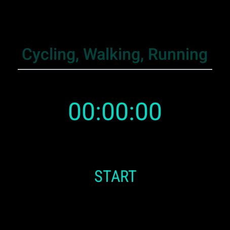
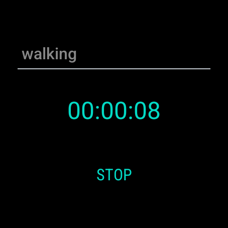
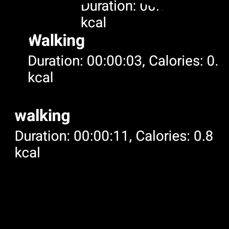

# WearableFitLog

## Overview
The WearableFitLog App is designed to help you track your workout sessions efficiently. It provides a user-friendly interface to log and review your workouts.

## Features
- Track different types of workouts
- View detailed session history
- Calculate calories burned

## Screenshots

### Home Screen




### Workout Session



### Session History



## Installation
1. Clone the repository:
    ```sh
    git clone https://github.com/yourusername/WearableFitLog.git
    ```
2. Open the project in Android Studio.
3. Build and run the app on an emulator or physical device.

## Usage
1. Open the app and navigate to the home screen.
2. Start a new workout session by selecting the type of workout.
3. Track your progress and end the session when done.
4. Review your session history to monitor your progress over time.

